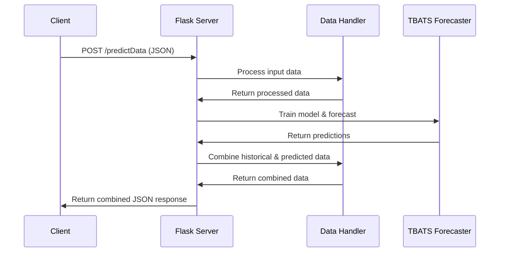
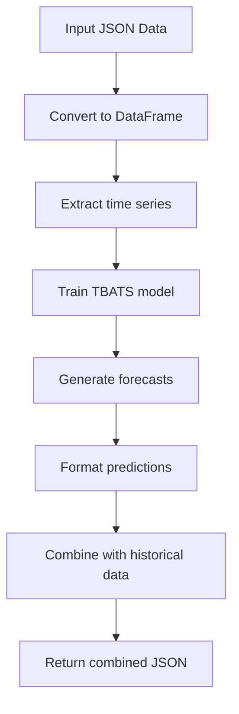

# Flask Server with TBATS Forecasting API - Implementation Plan

## 1. Project Overview

We'll create a Flask-based REST API server with a single endpoint `/predictData` that:
- Accepts historical time series data in JSON format
- Uses the TBATS model to forecast the next 10 data points
- Returns the combined historical and forecasted data as JSON

## 2. Project Structure

```
tbats-flask-server/
├── app.py               # Main Flask application
├── models/
│   └── forecaster.py    # TBATS forecasting implementation
├── utils/
│   └── data_handler.py  # Data preprocessing utilities
├── requirements.txt     # Project dependencies
└── README.md            # Project documentation
```

## 3. Dependencies

```
Flask==2.3.3
tbats==1.1.3
pandas==2.1.0
numpy==1.25.2
gunicorn==21.2.0  # For production deployment
```

## 4. Implementation Details

### 4.1. Flask Application (app.py)

The main application will:
- Initialize a Flask server
- Define the `/predictData` endpoint
- Handle JSON parsing and validation
- Coordinate data processing and model prediction
- Return the combined results



### 4.2. Data Handler (utils/data_handler.py)

The data handler will:
- Convert JSON input to pandas DataFrame
- Extract necessary time series components
- Format model output back to the original JSON structure
- Combine historical and predicted data

### 4.3. TBATS Forecaster (models/forecaster.py)

The forecaster will:
- Initialize and configure the TBATS model
- Train the model on historical data
- Generate forecasts for the next 10 periods
- Process forecast results



## 5. API Specification

### Endpoint: POST /predictData

**Request:**
- Content-Type: application/json
- Body: Array of objects with year and tfr fields

```json
[
  {"year": 1960, "tfr": 2.98},
  {"year": 1961, "tfr": 2.83},
  ...
]
```

**Response:**
- Content-Type: application/json
- Body: Array of objects including both historical and predicted data

```json
[
  {"year": 1960, "tfr": 2.98},
  ...
  {"year": 2023, "tfr": 1.158},
  {"year": 2024, "tfr": 1.123, "predicted": true},
  {"year": 2025, "tfr": 1.102, "predicted": true},
  ...
]
```

**Error Responses:**
- 400 Bad Request: Invalid JSON or missing required fields
- 500 Internal Server Error: Model training or prediction errors

## 6. Implementation Code Outline

### app.py
```python
from flask import Flask, request, jsonify
from models.forecaster import TBATSForecaster
from utils.data_handler import preprocess_data, postprocess_results

app = Flask(__name__)

@app.route('/predictData', methods=['POST'])
def predict_data():
    try:
        # Get JSON data from request
        data = request.get_json()
        
        # Validate input data
        if not data or not isinstance(data, list):
            return jsonify({"error": "Invalid input: Expected a JSON array"}), 400
            
        # Preprocess data for TBATS model
        processed_data = preprocess_data(data)
        
        # Initialize forecaster and make predictions
        forecaster = TBATSForecaster()
        predictions = forecaster.forecast(processed_data)
        
        # Combine historical and predicted data
        result = postprocess_results(data, predictions)
        
        return jsonify(result)
        
    except Exception as e:
        return jsonify({"error": str(e)}), 500

if __name__ == '__main__':
    app.run(debug=True, host='0.0.0.0', port=5000)
```

### forecaster.py
```python
import pandas as pd
import numpy as np
from tbats import TBATS

class TBATSForecaster:
    def __init__(self):
        # Default TBATS model configuration
        self.model_params = {
            'use_box_cox': True,
            'use_trend': True,
            'use_damped_trend': False,
        }
    
    def forecast(self, data, forecast_periods=10):
        """
        Train TBATS model on historical data and generate forecasts
        
        Args:
            data (pd.DataFrame): DataFrame with 'year' and 'tfr' columns
            forecast_periods (int): Number of periods to forecast
            
        Returns:
            pd.DataFrame: DataFrame with forecasted values
        """
        # Create and fit TBATS model
        estimator = TBATS(**self.model_params)
        model = estimator.fit(data['tfr'])
        
        # Generate forecasts
        forecast = model.forecast(steps=forecast_periods)
        
        # Create DataFrame with forecasted values
        next_years = range(data['year'].max() + 1, data['year'].max() + forecast_periods + 1)
        forecast_df = pd.DataFrame({
            'year': next_years,
            'tfr': forecast,
            'predicted': True
        })
        
        return forecast_df
```

### data_handler.py
```python
import pandas as pd
import numpy as np

def preprocess_data(json_data):
    """
    Convert JSON input to pandas DataFrame for model processing
    
    Args:
        json_data (list): List of dictionaries with year and tfr values
        
    Returns:
        pd.DataFrame: DataFrame with year and tfr columns
    """
    # Convert to DataFrame
    df = pd.DataFrame(json_data)
    
    # Verify required columns
    if 'year' not in df.columns or 'tfr' not in df.columns:
        raise ValueError("Input data must contain 'year' and 'tfr' fields")
    
    # Sort by year to ensure chronological order
    df = df.sort_values('year')
    
    return df

def postprocess_results(original_data, predictions):
    """
    Combine original data with predictions and format for response
    
    Args:
        original_data (list): Original JSON input data
        predictions (pd.DataFrame): DataFrame with predicted values
        
    Returns:
        list: Combined list of dictionaries for JSON response
    """
    # Add predicted=False flag to historical data
    for item in original_data:
        item['predicted'] = False
    
    # Convert predictions to list of dictionaries
    prediction_list = predictions.to_dict(orient='records')
    
    # Combine historical and predicted data
    combined_data = original_data + prediction_list
    
    return combined_data
```

## 7. Testing Strategy

1. **Unit Testing**:
   - Test data preprocessing and postprocessing functions
   - Test TBATS forecaster with sample data

2. **Integration Testing**:
   - Test Flask endpoint with various input data
   - Verify response format matches expectations

3. **Error Handling**:
   - Test with invalid inputs
   - Test with edge cases (very short time series, etc.)

## 8. Deployment Considerations

1. **Production Server**:
   - Use Gunicorn as a WSGI HTTP server
   - Consider adding a reverse proxy like Nginx for production deployments

2. **Environment Variables**:
   - Configure Flask settings via environment variables

3. **Performance**:
   - TBATS model can be computationally intensive
   - Consider caching frequent predictions or pre-computing models

4. **Scaling**:
   - For high-traffic scenarios, consider containerization with Docker
   - Implement load balancing for multiple server instances if needed

## 9. Future Enhancements (if needed)

1. Request validation middleware
2. Caching mechanism for frequent predictions
3. Model parameter tuning endpoint
4. Visualization endpoint for time series data
5. Authentication for API access