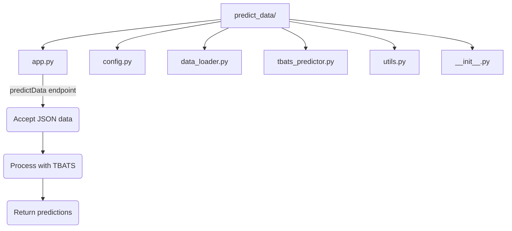
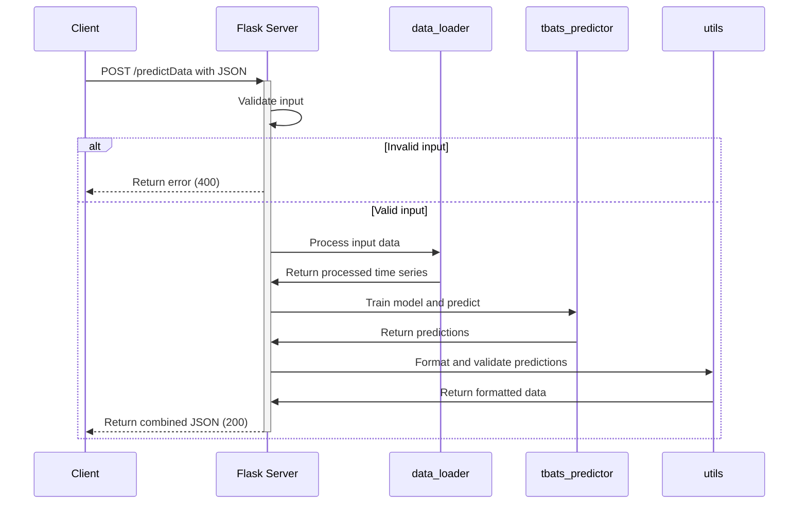

# Flask TBATS Prediction Server Implementation Plan

This document outlines the plan to transform the existing `predict_data` project into a Flask server that accepts fertility rate data in JSON format and returns TBATS model predictions.

## 1. Project Structure Changes



The project structure will be modified as follows:
- Add a new `app.py` file for the Flask server
- Update the existing modules to work with the new API-based approach
- Retain the existing model logic and utility functions

## 2. Implementation Details

### 2.1 Flask Server (`app.py`)

We'll create a new Flask application with a `predictData` endpoint that:
- Accepts POST requests with JSON data
- Validates the input format
- Processes the data using the TBATS model
- Returns the combined data (historical + predictions) as JSON

Key features:
- CORS support for cross-origin requests
- Proper error handling and input validation
- Configurable number of prediction steps (default: 10)

### 2.2 Code Adaptations

#### `data_loader.py` modifications:
- Keep the existing functions
- Add capability to process data directly from JSON input instead of file

#### `utils.py` modifications:
- Keep the formatting and validation functions
- Remove the file-saving function as we'll return the JSON response directly

#### `config.py` modifications:
- Keep the TBATS model parameters
- Remove file path configurations as they'll no longer be needed

#### `tbats_predictor.py`:
- Can be used as-is without modification

## 3. Workflow



## 4. API Specification

### Endpoint: `/predictData`
- **Method**: POST
- **Content-Type**: application/json

**Request Body**:
```json
[
  {
    "year": 1960,
    "tfr": 2.98
  },
  // More year/tfr pairs...
]
```

**Response**:
```json
[
  {
    "year": 1960,
    "tfr": 2.98
  },
  // Historical data...
  {
    "year": 2023,
    "tfr": 1.158
  },
  // Predictions...
  {
    "year": 2024,
    "tfr": 1.112
  },
  // More predictions...
]
```

**Error Responses**:
- 400 Bad Request: Invalid input format
- 500 Internal Server Error: Error during processing

## 5. Implementation Code Examples

### 5.1 Flask Server (`app.py`)

```python
from flask import Flask, request, jsonify
from flask_cors import CORS
import json

from .data_loader import convert_to_time_series, preprocess_data
from .tbats_predictor import TBATSPredictor
from .utils import format_predictions, combine_data, validate_predictions
from .config import DEFAULT_STEPS, TBATS_PARAMS

app = Flask(__name__)
CORS(app)

@app.route('/predictData', methods=['POST'])
def predict_data():
    try:
        # Get JSON data from request
        request_data = request.get_json()
        
        # Validate input format
        if not isinstance(request_data, list):
            return jsonify({"error": "Input must be a list of year/tfr objects"}), 400
            
        if not all(isinstance(item, dict) and 'year' in item and 'tfr' in item for item in request_data):
            return jsonify({"error": "Each item must contain 'year' and 'tfr' fields"}), 400
        
        # Process the input data
        ts_data = convert_to_time_series(request_data)
        preprocessed_data = preprocess_data(ts_data)
        
        # Train TBATS model and generate predictions
        predictor = TBATSPredictor(**TBATS_PARAMS)
        fitted_model = predictor.train(preprocessed_data)
        predictions = predictor.predict(steps=DEFAULT_STEPS)
        
        # Format predictions
        last_year = max(item['year'] for item in request_data)
        formatted_predictions = format_predictions(request_data, predictions, last_year + 1)
        
        # Validate predictions to ensure they are within reasonable bounds
        validated_predictions = validate_predictions(formatted_predictions)
        
        # Combine historical data with predictions
        combined_data = combine_data(request_data, validated_predictions)
        
        # Return the combined result
        return jsonify(combined_data)
        
    except Exception as e:
        return jsonify({"error": str(e)}), 500

if __name__ == '__main__':
    app.run(debug=True, host='0.0.0.0', port=5000)
```

### 5.2 Tests to Verify Implementation

We should create simple tests to verify the API works correctly:

1. Test with valid input data
2. Test with invalid input formats
3. Test with edge cases (empty data, very large datasets)

## 6. Testing Plan

1. **Unit Testing**:
   - Test data preprocessing functions with various inputs
   - Test prediction formatting and validation

2. **API Testing**:
   - Test endpoint with valid requests
   - Test error handling with invalid requests
   - Verify response format

3. **Manual Testing**:
   - Using Postman or curl to send requests to the API
   - Verify the predictions match expected results

## 7. Potential Challenges and Solutions

1. **Challenge**: Large datasets may cause performance issues
   **Solution**: Add input size limits and optimization for large datasets

2. **Challenge**: Invalid input data may cause crashes
   **Solution**: Implement thorough validation before processing

3. **Challenge**: The prediction model may take too long to train
   **Solution**: Consider adding caching mechanism for frequent requests with similar data

## 8. Implementation Timeline

1. Setup Flask application structure (1 hour)
2. Implement the prediction endpoint (2 hours)
3. Test and debug the API (2 hours)
4. Optimize and finalize (1 hour)

Total estimated time: 6 hours

## 9. Deployment Considerations

1. For production deployment:
   - Use a WSGI server like Gunicorn or uWSGI
   - Consider containerization with Docker
   - Set up proper logging and monitoring

2. Security considerations:
   - Rate limiting to prevent abuse
   - Input validation to prevent injection attacks
   - Consider authentication for sensitive APIs