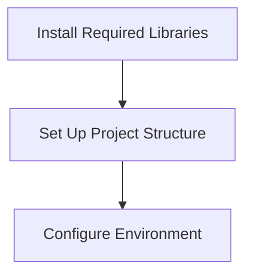
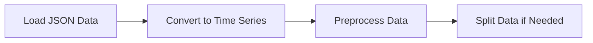
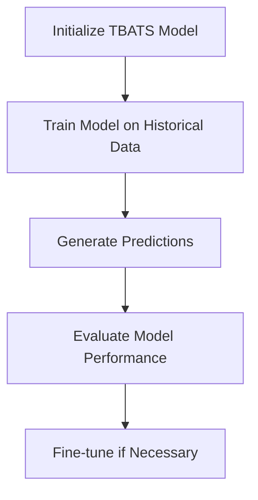
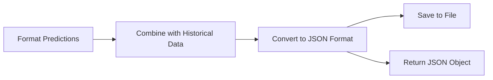
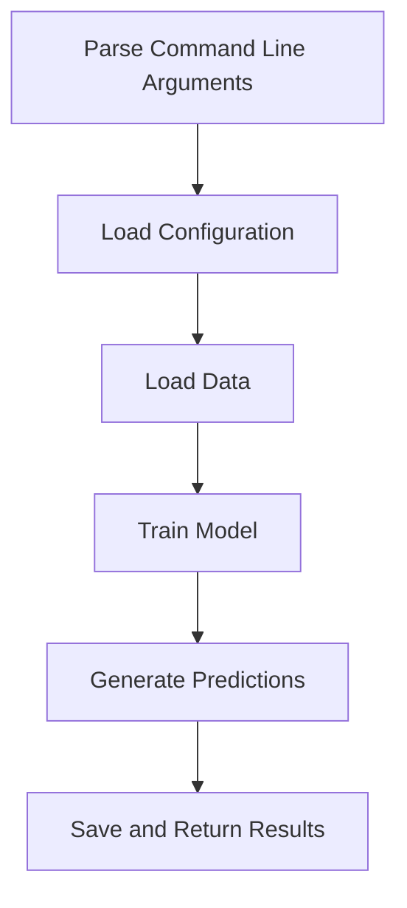

# Implementation Plan: TBATS Model for Fertility Rate Prediction

Based on the information gathered, this document outlines a detailed implementation plan for developing a Python application that uses the TBATS model to predict fertility rates in Poland for the next 5 years.

## 1. Project Structure

```
predict_data/
├── __init__.py
├── config.py            # Configuration parameters
├── data_loader.py       # Functions to load and preprocess data
├── tbats_predictor.py   # TBATS model implementation
├── main.py              # Main script to run the prediction
└── utils.py             # Utility functions
```

## 2. Implementation Steps

### 2.1. Environment Setup



1. Install required libraries:
   - `tbats` - For implementing the TBATS model
   - `pandas` - For data manipulation
   - `numpy` - For numerical operations
   - Other dependencies as needed

2. Create the project structure as outlined above

### 2.2. Data Processing Pipeline



1. **Data Loading (data_loader.py)**:
   - Create functions to load the fertility rate data from the JSON file
   - Parse the data into a format suitable for time series analysis
   - Handle any missing values or anomalies

2. **Data Preprocessing**:
   - Convert the data into a time series format
   - Ensure the data is properly ordered by year
   - Apply any necessary transformations (if required)

### 2.3. TBATS Model Implementation



1. **Model Implementation (tbats_predictor.py)**:
   - Create a class to encapsulate the TBATS model functionality
   - Implement methods for training the model on historical data
   - Implement methods for generating predictions

2. **Prediction Generation**:
   - Use the trained model to predict fertility rates for the next 5 years (2024-2028)
   - Ensure the predictions are in the correct format

### 2.4. Output Generation



1. **Output Formatting (utils.py)**:
   - Format the predictions to match the structure of the input data
   - Combine the historical data with the predictions
   - Convert the combined data to JSON format

2. **Output Saving**:
   - Save the JSON data to a file in the predict_data folder
   - Also return the JSON object for potential use by other applications

### 2.5. Main Script Implementation



1. **Main Script (main.py)**:
   - Parse command line arguments (if any)
   - Load configuration parameters
   - Orchestrate the entire prediction process
   - Handle any errors or exceptions

## 3. Detailed Component Specifications

### 3.1. config.py

This file will contain configuration parameters for the application:
- Input file path
- Output file path
- Number of years to predict (default: 5)
- TBATS model parameters (using defaults as specified)

### 3.2. data_loader.py

This module will handle data loading and preprocessing:
- Function to load data from JSON file
- Function to convert data to time series format
- Function to preprocess data for the TBATS model

### 3.3. tbats_predictor.py

This module will implement the TBATS model:
- TBATSPredictor class with methods for:
  - Initializing the model
  - Training the model on historical data
  - Generating predictions
  - Evaluating model performance

### 3.4. utils.py

This module will contain utility functions:
- Function to format predictions
- Function to combine historical data with predictions
- Function to convert data to JSON format
- Function to save data to file

### 3.5. main.py

This will be the main script to run the prediction:
- Parse command line arguments
- Load configuration
- Load and preprocess data
- Train the TBATS model
- Generate predictions
- Save and return results

## 4. Implementation Details

### 4.1. Data Loading and Preprocessing

```python
# Example code for data_loader.py
import json
import pandas as pd
import numpy as np

def load_data(file_path):
    """Load fertility rate data from JSON file."""
    with open(file_path, 'r') as f:
        data = json.load(f)
    return data

def convert_to_time_series(data):
    """Convert JSON data to time series format."""
    # Extract years and fertility rates
    years = [item['year'] for item in data]
    tfr = [item['tfr'] for item in data]
    
    # Create a pandas Series with years as index
    ts_data = pd.Series(tfr, index=years)
    return ts_data

def preprocess_data(ts_data):
    """Preprocess time series data for TBATS model."""
    # Ensure data is sorted by year
    ts_data = ts_data.sort_index()
    
    # Handle any missing values if needed
    # ts_data = ts_data.interpolate()
    
    return ts_data
```

### 4.2. TBATS Model Implementation

```python
# Example code for tbats_predictor.py
from tbats import TBATS

class TBATSPredictor:
    def __init__(self, use_box_cox=None, use_trend=None, use_damped_trend=None):
        """Initialize TBATS predictor with optional parameters."""
        self.model = None
        self.fitted_model = None
        self.model_params = {
            'use_box_cox': use_box_cox,
            'use_trend': use_trend,
            'use_damped_trend': use_damped_trend,
        }
    
    def train(self, ts_data):
        """Train TBATS model on historical data."""
        # Initialize TBATS model with parameters
        self.model = TBATS(**self.model_params)
        
        # Fit the model to the data
        self.fitted_model = self.model.fit(ts_data)
        
        return self.fitted_model
    
    def predict(self, steps=5):
        """Generate predictions for specified number of steps."""
        if self.fitted_model is None:
            raise ValueError("Model must be trained before making predictions")
        
        # Generate forecast
        forecast = self.fitted_model.forecast(steps=steps)
        
        return forecast
```

### 4.3. Output Generation

```python
# Example code for utils.py
import json
import pandas as pd

def format_predictions(historical_data, predictions, start_year):
    """Format predictions to match the structure of historical data."""
    formatted_predictions = []
    
    for i, pred in enumerate(predictions):
        year = start_year + i
        formatted_predictions.append({
            "year": year,
            "tfr": float(pred)
        })
    
    return formatted_predictions

def combine_data(historical_data, predictions):
    """Combine historical data with predictions."""
    combined_data = historical_data.copy()
    combined_data.extend(predictions)
    return combined_data

def save_to_json(data, file_path):
    """Save data to JSON file."""
    with open(file_path, 'w', encoding='utf-8') as f:
        json.dump(data, f, indent=2)
    
    return data
```

### 4.4. Main Script

```python
# Example code for main.py
import argparse
import os
from data_loader import load_data, convert_to_time_series, preprocess_data
from tbats_predictor import TBATSPredictor
from utils import format_predictions, combine_data, save_to_json
from config import DEFAULT_INPUT_PATH, DEFAULT_OUTPUT_PATH, DEFAULT_STEPS

def main():
    """Main function to run the prediction process."""
    # Parse command line arguments
    parser = argparse.ArgumentParser(description='Predict fertility rates using TBATS model')
    parser.add_argument('--input', type=str, default=DEFAULT_INPUT_PATH,
                        help='Path to input JSON file')
    parser.add_argument('--output', type=str, default=DEFAULT_OUTPUT_PATH,
                        help='Path to output JSON file')
    parser.add_argument('--steps', type=int, default=DEFAULT_STEPS,
                        help='Number of years to predict')
    args = parser.parse_args()
    
    # Load and preprocess data
    historical_data = load_data(args.input)
    ts_data = convert_to_time_series(historical_data)
    preprocessed_data = preprocess_data(ts_data)
    
    # Train TBATS model
    predictor = TBATSPredictor()
    fitted_model = predictor.train(preprocessed_data)
    
    # Generate predictions
    predictions = predictor.predict(steps=args.steps)
    
    # Format and combine predictions with historical data
    last_year = max(item['year'] for item in historical_data)
    formatted_predictions = format_predictions(historical_data, predictions, last_year + 1)
    combined_data = combine_data(historical_data, formatted_predictions)
    
    # Save to file and return JSON object
    result = save_to_json(combined_data, args.output)
    
    return result

if __name__ == '__main__':
    main()
```

## 5. Testing and Validation

Although tests are not required, it's still important to validate the model's predictions. This can be done by:

1. Checking if the predictions are reasonable given the historical trend
2. Ensuring the output JSON has the correct structure
3. Verifying that the application runs without errors

## 6. Potential Challenges and Solutions

1. **Challenge**: The TBATS model may not capture complex patterns in fertility rates.
   **Solution**: The default parameters should work well, but we can adjust them if needed.

2. **Challenge**: The data may have missing values or anomalies.
   **Solution**: The preprocessing step will handle these issues.

3. **Challenge**: The predictions may be unrealistic (e.g., negative fertility rates).
   **Solution**: We can add post-processing to ensure predictions are within reasonable bounds.

## 7. Implementation Timeline

1. **Day 1**: Set up project structure and implement data loading
2. **Day 2**: Implement TBATS model and prediction generation
3. **Day 3**: Implement output formatting and saving
4. **Day 4**: Integrate all components and test the application
5. **Day 5**: Finalize documentation and deliver the application

This implementation plan provides a comprehensive approach to developing a Python application that uses the TBATS model to predict fertility rates in Poland for the next 5 years. The application will be structured in a modular way, making it easy to maintain and extend in the future.