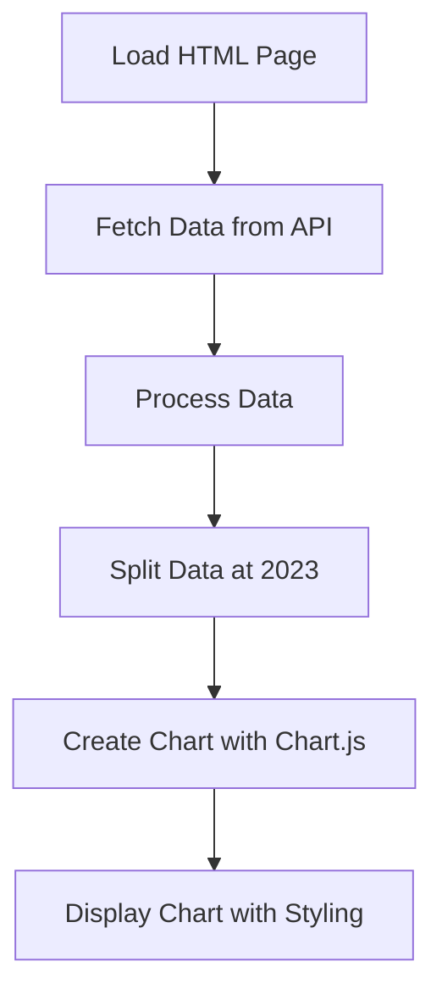

# Plan for Implementing the Fertility Rate Chart Application

I'll create a web application that displays Poland's fertility rate data in a chart, with historical data (up to 2023) shown as a solid blue line and predictions (after 2023) as a dashed red line. The application will feature a Polish title and an enhanced visual design with an appealing color scheme.

## Application Structure

```
presentation_chart/
├── index.html          # Main HTML file
├── styles.css          # CSS styles
├── script.js           # JavaScript for fetching data and creating the chart
└── README.md           # Documentation
```

## Technical Approach



### 1. Frontend Structure (HTML)

The `index.html` file will:
- Include necessary Chart.js library
- Define a container for the chart
- Include links to CSS and JavaScript files
- Provide a simple, responsive layout
- Feature both Polish and English titles

### 2. Data Fetching (JavaScript)

The `script.js` file will:
- Make an AJAX request to `http://localhost:5000/getData`
- Process the received JSON data
- Split the data into two datasets:
  * Historical data (up to 2023)
  * Prediction data (after 2023)

### 3. Chart Creation (Chart.js)

Using Chart.js, we'll:
- Create a line chart with two datasets
- Configure the historical dataset with a visually appealing blue gradient line
- Configure the prediction dataset with a contrasting red dashed line
- Set appropriate labels, titles, and axes
- Use a custom color palette for better visual appeal

### 4. Styling (CSS)

The `styles.css` file will:
- Style the chart container
- Ensure responsive design
- Add appropriate margins, padding, and fonts
- Create a clean, professional look
- Use a modern color scheme with complementary colors
- Add subtle visual enhancements like shadows and gradients

## Implementation Details

### HTML Structure

```html
<!DOCTYPE html>
<html lang="pl">
<head>
    <meta charset="UTF-8">
    <meta name="viewport" content="width=device-width, initial-scale=1.0">
    <title>Wskaźnik Dzietności w Polsce | Poland Fertility Rate Chart</title>
    <link rel="stylesheet" href="styles.css">
    <script src="https://cdn.jsdelivr.net/npm/chart.js"></script>
    <link href="https://fonts.googleapis.com/css2?family=Roboto:wght@300;400;500&display=swap" rel="stylesheet">
</head>
<body>
    <div class="container">
        <h1 class="polish-title">Wskaźnik Dzietności w Polsce (1960-2033)</h1>
        <h2 class="english-subtitle">Poland Fertility Rate (1960-2033)</h2>
        <div class="chart-container">
            <canvas id="fertilityChart"></canvas>
        </div>
        <div class="legend">
            <div class="legend-item">
                <div class="legend-color historical"></div>
                <span>Dane historyczne (1960-2023) | Historical Data</span>
            </div>
            <div class="legend-item">
                <div class="legend-color prediction"></div>
                <span>Dane prognozowane (2024-2033) | Predicted Data</span>
            </div>
        </div>
    </div>
    <script src="script.js"></script>
</body>
</html>
```

### JavaScript Implementation

```javascript
document.addEventListener('DOMContentLoaded', function() {
    // Fetch data from the API
    fetch('http://localhost:5000/getData')
        .then(response => {
            if (!response.ok) {
                throw new Error('Network response was not ok');
            }
            return response.json();
        })
        .then(data => {
            // Process and display the data
            createChart(data);
        })
        .catch(error => {
            console.error('Error fetching data:', error);
            document.querySelector('.chart-container').innerHTML = 
                '<div class="error">Error loading data. Please make sure the API server is running at http://localhost:5000</div>';
        });
});

function createChart(data) {
    // Split data into historical and prediction
    const historicalData = data.filter(item => item.year <= 2023);
    const predictionData = data.filter(item => item.year > 2023);
    
    // Prepare datasets
    const years = data.map(item => item.year);
    const historicalYears = historicalData.map(item => item.year);
    const predictionYears = predictionData.map(item => item.year);
    
    const historicalTFR = historicalData.map(item => item.tfr);
    const predictionTFR = predictionData.map(item => item.tfr);
    
    // Get the chart canvas
    const ctx = document.getElementById('fertilityChart').getContext('2d');
    
    // Create the chart
    const fertilityChart = new Chart(ctx, {
        type: 'line',
        data: {
            labels: years,
            datasets: [
                {
                    label: 'Dane historyczne (1960-2023) | Historical Data',
                    data: [...historicalTFR, ...Array(predictionYears.length).fill(null)],
                    borderColor: function(context) {
                        const chart = context.chart;
                        const {ctx, chartArea} = chart;
                        if (!chartArea) {
                            return 'rgba(54, 162, 235, 1)';
                        }
                        const gradient = ctx.createLinearGradient(0, 0, 0, chartArea.bottom);
                        gradient.addColorStop(0, 'rgba(54, 162, 235, 1)');
                        gradient.addColorStop(1, 'rgba(54, 162, 235, 0.6)');
                        return gradient;
                    },
                    backgroundColor: 'rgba(54, 162, 235, 0.1)',
                    borderWidth: 3,
                    tension: 0.2,
                    pointRadius: 3,
                    pointBackgroundColor: 'rgba(54, 162, 235, 1)',
                    pointHoverRadius: 6,
                    pointHoverBackgroundColor: 'white',
                    pointHoverBorderWidth: 2
                },
                {
                    label: 'Dane prognozowane (2024-2033) | Predicted Data',
                    data: [...Array(historicalYears.length).fill(null), ...predictionTFR],
                    borderColor: 'rgba(255, 99, 132, 1)',
                    backgroundColor: 'rgba(255, 99, 132, 0.1)',
                    borderWidth: 3,
                    borderDash: [6, 6],
                    tension: 0.2,
                    pointRadius: 3,
                    pointBackgroundColor: 'rgba(255, 99, 132, 1)',
                    pointHoverRadius: 6,
                    pointHoverBackgroundColor: 'white',
                    pointHoverBorderWidth: 2
                }
            ]
        },
        options: {
            responsive: true,
            maintainAspectRatio: false,
            plugins: {
                title: {
                    display: true,
                    text: 'Wskaźnik Dzietności w Polsce (TFR) - Dane historyczne i prognozowane',
                    font: {
                        size: 18,
                        weight: 'bold',
                        family: "'Roboto', sans-serif"
                    },
                    padding: {
                        top: 10,
                        bottom: 20
                    }
                },
                tooltip: {
                    mode: 'index',
                    intersect: false
                },
                legend: {
                    display: true,
                    position: 'top'
                }
            },
            scales: {
                x: {
                    title: {
                        display: true,
                        text: 'Year'
                    },
                    ticks: {
                        callback: function(value, index) {
                            // Show fewer x-axis labels for better readability
                            return index % 5 === 0 ? years[index] : '';
                        }
                    }
                },
                y: {
                    title: {
                        display: true,
                        text: 'Total Fertility Rate (TFR)'
                    },
                    min: 0,
                    suggestedMax: 3.5
                }
            }
        }
    });
}
```

### CSS Styling

```css
body {
    font-family: 'Roboto', 'Segoe UI', Tahoma, Geneva, Verdana, sans-serif;
    margin: 0;
    padding: 20px;
    background-color: #f0f5ff;
    color: #2c3e50;
    line-height: 1.6;
}

.container {
    max-width: 1200px;
    margin: 0 auto;
    background-color: white;
    border-radius: 12px;
    box-shadow: 0 4px 20px rgba(0, 0, 0, 0.08);
    padding: 30px;
    border: 1px solid rgba(0, 0, 0, 0.05);
}

.polish-title {
    text-align: center;
    margin-bottom: 5px;
    color: #2c3e50;
    font-weight: 500;
    font-size: 28px;
}

.english-subtitle {
    text-align: center;
    margin-top: 0;
    margin-bottom: 30px;
    color: #7f8c8d;
    font-weight: 300;
    font-size: 18px;
}

.chart-container {
    position: relative;
    height: 60vh;
    min-height: 400px;
    margin-bottom: 30px;
    padding: 15px;
    background-color: rgba(255, 255, 255, 0.8);
    border-radius: 8px;
    box-shadow: inset 0 0 10px rgba(0, 0, 0, 0.03);
}

.legend {
    display: flex;
    justify-content: center;
    margin-top: 20px;
    flex-wrap: wrap;
}

.legend-item {
    display: flex;
    align-items: center;
    margin: 0 15px;
}

.legend-color {
    width: 25px;
    height: 4px;
    margin-right: 10px;
    border-radius: 2px;
}

.legend-color.historical {
    background: linear-gradient(to right, rgba(54, 162, 235, 1), rgba(54, 162, 235, 0.6));
    box-shadow: 0 1px 3px rgba(54, 162, 235, 0.3);
}

.legend-color.prediction {
    background-color: rgba(255, 99, 132, 1);
    border-top: 2px dashed rgba(255, 99, 132, 1);
    box-shadow: 0 1px 3px rgba(255, 99, 132, 0.3);
}

.error {
    color: #dc3545;
    text-align: center;
    padding: 20px;
    font-weight: bold;
}

@media (max-width: 768px) {
    .chart-container {
        height: 50vh;
        min-height: 300px;
    }
    
    h1 {
        font-size: 1.5rem;
    }
    
    .legend-item {
        margin: 5px 10px;
    }
}
```

### README.md

```markdown
# Poland Fertility Rate Chart

This web application displays Poland's fertility rate data from 1960 to 2033, with historical data up to 2023 shown as a solid blue line and predictions from 2024 to 2033 shown as a dashed red line.

## Features

- Fetches fertility rate data from a local API endpoint
- Displays data in an interactive chart using Chart.js
- Clearly distinguishes between historical and predicted data
- Responsive design that works on desktop and mobile devices

## Setup and Usage

1. Make sure the API server is running at http://localhost:5000
2. Open `index.html` in a web browser

## Dependencies

- Chart.js (loaded from CDN)

## Data Source

The application fetches data from the `/getData` endpoint at localhost:5000, which provides fertility rate data for Poland from 1960 to 2033.
```

## Error Handling

The application includes error handling for:
- API connection failures
- Data processing issues
- Responsive design for different screen sizes

## Note

This application does not require automated tests. Manual verification during development will be sufficient to ensure it works as expected.